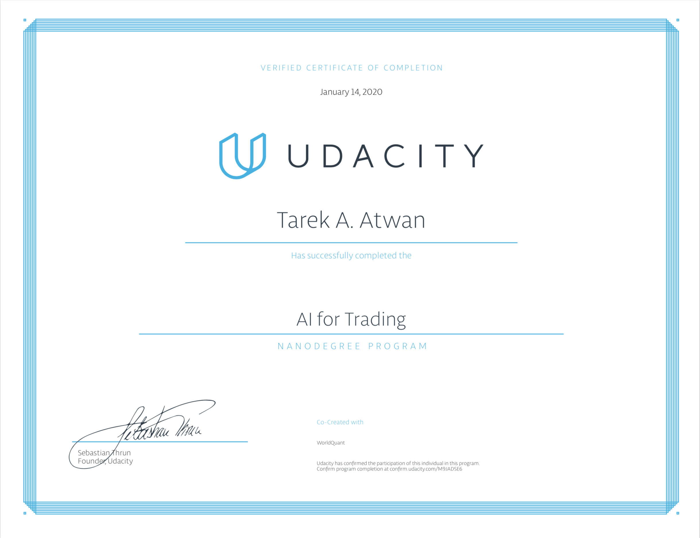

# Artificial Intelligence for Trading Nanodegree

[Source](https://www.businesswire.com/news/home/20180816005146/en/WorldQuant-Udacity-Partner-Offer-Artificial-Intelligence-Trading)

WorldQuant, a global quantitative asset management firm, in partnership with global online learning company Udacity announces the launch of a new Artificial Intelligence for Trading Nanodegree program. Students enrolled in the program will analyze real data and build financial models by learning the basics of quantitative trading, as well as how to analyze alternative data and use machine learning to generate trading signals.

Udacity and WorldQuant have collaborated with top industry professionals with prior experience at leading financial institutions to ensure students are exposed to the latest AI applications in trading and quantitative finance. By learning from industry experts, students will advance their finance knowledge, build a strong portfolio of real-world projects and learn to generate trading signals using natural language processing, recurrent neural networks and random forests. Graduates will gain the quantitative skills currently in demand across multiple functions and roles at hedge funds, investment banks and fintech startups.

The program consists of two three-month terms. In the first term, students learn the basics of quantitative analysis, covering data processing, trading signal generation and portfolio management. The second term is focused on AI Algorithms for Trading, where students work with alternative data and use machine learning to generate trading signals and run backtests to evaluate signals

## Nanodegree Program Information

This nanodegree program is comprised of 8 courses and 8 projects, which are described in detail below.
Building a project is one of the best ways to demonstrate the skills we've learned around the mastery of
quantitative finance.

* **Project 1**: Trading with Momentum 
* **Project 2**: Breakout Strategy
* **Project 3**: Smart Beta and Portfolio Optimization
* **Project 4**: Alpha Research and Factor Modeling
* **Project 5**: NLP on Financial Statements (generate Alpha Factors from 10-k)
* **Project 6**: Sentiment Analysis with Neural Networks (LSTM)
* **Project 7**: Combining Signals for Enhancing Alphas (using Machine Learning)
* **Project 8**: Backtesting (Barra data)

## Project 1: Trading with Momentum

In this project, you will learn to implement a trading strategy on your own, and test to see if it has the potential to be profitable. You will be supplied with a universe of stocks and time range. You will also be provided with a textual description of how to generate a trading signal based on a momentum indicator. You will then compute the signal for the time range given and apply it to the dataset to produce projected returns. Finally, you will perform a statistical test on the mean of the returns to conclude if there is alpha in the signal. For the dataset, we'll be using the end of day from Quotemedia.

## Project 2: Breakout Strategy 

In this project, you will implement the breakout strategy. You'll find and remove any outliers. You'll test to see if it has the potential to be profitable using a Histogram and P-Value. For the dataset, we'll be using the end of day from Quotemedia.

In this project, you will code and evaluate a breakout signal. You will run statistical tests to test for normality
and to find alpha. You will also learn to find outliers and evaluate the effect that filtered outliers could have
on your trading signal. You will run various scenarios of your model with or without the outliers and decide
if the outliers should be kept or not. You'll test to see if it has the potential to be profitable using a Histogram and P-Value. For the dataset, we'll be using the end of day from Quotemedia.

## Project 3: Smart Beta and Portfolio Optimization

In this project, you will build a smart beta portfolio and compare it to a benchmark index. To find out how well the smart beta portfolio did, you’ll calculate the tracking error against the index. You’ll then build a portfolio by using quadratic programming to optimize the weights. Your code will rebalance this portfolio and calculate turn over to evaluate the performance. You’ll use this metric to find the optimal rebalancing Frequency. For the dataset, we'll be using the end of day from Quotemedia.

## Project 4: Multi-Factor Model

In this project, you will build a statistical risk model using PCA. You’ll use this model to build a portfolio along with 5 alpha factors. You’ll create these factors, then evaluate them using factor-weighted returns, quantile analysis, sharpe ratio, and turnover analysis. At the end of the project, you’ll optimize the portfolio using the risk model and factors using multiple optimization formulations. For the dataset, we'll be using the end of day from Quotemedia and sector data from Sharadar.

## Project 5: NLP on Financial Statements

In this project, you will apply Natural Language Processing (NLP) on corporate filings, such as 10Q and 10K
statements, from cleaning data and text processing, to feature extraction and modeling. You will utilize
bag-of-words and TF-IDF to generate company-specific sentiments. Based on the sentiments, you will decide
which company to invest in, and the optimal time to buy or sell. You will use NLP generate an alpha factor.For the dataset, we'll be using the end of day from Quotemedia and Loughran-McDonald sentiment word lists.

## Project 6: Sentiment Analysis with Neural Networks

In this project, you'll build your own deep learning model to classify the sentiment of messages from StockTwits, a social network for investors and traders. Your model will be able to predict if any particular message is positive or negative. From this, you'll be able to generate a signal of the public sentiment for various ticker symbols.

> You will construct and train LSTM networks for sentiment classification. You will run backtests and apply the models to news data for signal generation

## Project 7: Combining Signals for Enhanced Alphas

In this project, you'll combine signals on a random forest for enhanced alpha. While implementing this, you'll have to solve the problem of overlapping samples. For the dataset, we'll be using the end of day from Quotemedia and sector data from Sharadar.

## Project 8: Backtesting

In this project, you will build a fairly realistic backtester that uses the Barra data. The backtester will perform
portfolio optimization that includes transaction costs, and you'll implement it with computational efficiency
in mind, to allow for a reasonably fast backtest. You'll also use performance attribution to identify the major
drivers of your portfolio's profit-and-loss (PnL). You will have the option to modify and customize the
backtest as well.